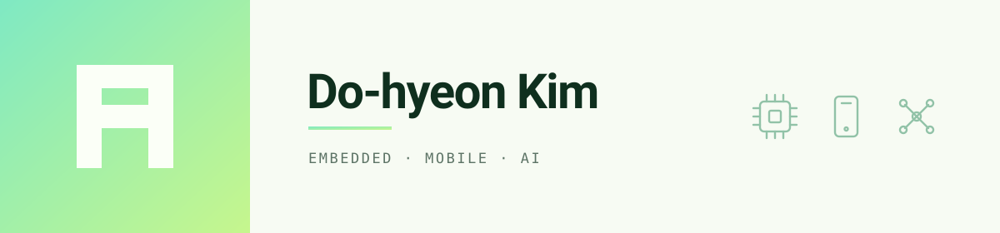

## 👋 About Me

임베디드 통신·제어, 모바일 애플리케이션 개발

- React Native 기반 WorkProof 앱 개발
- STM32 기반 통신 및 제어
- LLM 기반 음성 제어 자율주행 배송 로봇 하드웨어 제작

 

## 🛠 Skills

### Languages

  
  
  
  

### Embedded

  
  

### Protocols

  
  

### App · Web

  
  
  

### Database

  
  

### Design · 3D

  
  

### Tools

  
  
  

 

## 📫 Contact

